# TCM-Sage Architecture Diagrams

These diagrams are designed for the FYP Mid-Point Presentation. Render them using any Mermaid-compatible tool (VS Code preview, Mermaid Live Editor, etc.).

---

## 1. System Flow Diagram

This diagram shows the end-to-end query processing pipeline, highlighting the two key innovations: **Query Classification** and **Dynamic LLM Routing**.

```mermaid
flowchart TD
    subgraph INPUT["1️⃣ INPUT"]
        A[/"User Query<br/>(e.g., '頭痛如何治療？')"/]
    end

    subgraph CLASSIFY["2️⃣ QUERY CLASSIFICATION ⭐"]
        B{{"Classifier LLM<br/>(Lightweight)"}}
        B --> C{"Severity?"}
        C -->|Informational| D["General Knowledge<br/>(e.g., 'What is Yin-Yang?')"]
        C -->|Prescriptive| E["Medical Advice<br/>(e.g., 'How to treat headaches?')"]
    end

    subgraph RETRIEVE["3️⃣ HYBRID RETRIEVAL"]
        F[("ChromaDB<br/>Vector Store")]
        G[("NetworkX<br/>Knowledge Graph")]
        H["HybridRetriever"]
        F --> H
        G --> H
    end

    subgraph SYNTHESIZE["4️⃣ DYNAMIC SYNTHESIS ⭐"]
        I["Informational LLM<br/>(temp=0.1)"]
        J["Prescriptive LLM<br/>(temp=0.0)"]
        K["LangChain RAG Chain"]
    end

    subgraph OUTPUT["5️⃣ OUTPUT"]
        L[/"Evidence-Backed Response<br/>with Source Citations"/]
    end

    A --> B
    D --> H
    E --> H
    H -->|"Vector + Graph Context"| K
    D -.->|"Route"| I
    E -.->|"Route"| J
    I --> K
    J --> K
    K --> L

    style CLASSIFY fill:#e6f3ff,stroke:#0066cc
    style SYNTHESIZE fill:#e6f3ff,stroke:#0066cc
    style B fill:#ffcc00,stroke:#996600
    style I fill:#99ccff,stroke:#3366cc
    style J fill:#ff9999,stroke:#cc3333
```



---

## 2. System Architecture Diagram

This diagram shows the modular component structure and data flow between layers.

```mermaid
flowchart TB
    subgraph UI["🖥️ User Interface Layer"]
        direction LR
        CLI["CLI<br/>(main.py)"]
        WebUI["Streamlit UI<br/>(ui_app.py)"]
    end

    subgraph BACKEND["⚙️ Backend Layer"]
        direction TB
        UIBackend["UI Backend<br/>(ui_backend.py)"]
        
        subgraph PIPELINE["RAG Pipeline"]
            direction LR
            QueryRouter["Query Router<br/>get_query_severity()"]
            RAGChain["LangChain LCEL<br/>RAG Chain"]
        end
    end

    subgraph RETRIEVAL["🔍 Retrieval Layer"]
        direction TB
        HybridRet["HybridRetriever<br/>(retriever.py)"]
        
        subgraph SOURCES["Data Sources"]
            direction LR
            VectorDB[("ChromaDB<br/>Vector Store")]
            KnowledgeGraph[("TCMKnowledgeGraph<br/>(graph_builder.py)")]
        end
    end

    subgraph GENERATION["🧠 Generation Layer"]
        direction LR
        ClassifierLLM["Classifier LLM<br/>(Fast, Lightweight)"]
        InfoLLM["Informational LLM<br/>(temp=0.1)"]
        PrescLLM["Prescriptive LLM<br/>(temp=0.0)"]
    end

    subgraph DATA["📚 Data Layer"]
        direction LR
        RawText["Huangdi Neijing<br/>(黃帝内經)"]
        GraphJSON["entities.json<br/>(TCM Entities)"]
    end

    %% Connections
    CLI --> PIPELINE
    WebUI --> UIBackend --> PIPELINE
    
    QueryRouter --> ClassifierLLM
    RAGChain --> HybridRet
    RAGChain --> InfoLLM
    RAGChain --> PrescLLM
    
    HybridRet --> VectorDB
    HybridRet --> KnowledgeGraph
    
    RawText -.->|"ingest.py"| VectorDB
    GraphJSON -.->|"load_from_json()"| KnowledgeGraph

    style UI fill:#d4edda,stroke:#28a745
    style PIPELINE fill:#fff3cd,stroke:#ffc107
    style RETRIEVAL fill:#cce5ff,stroke:#007bff
    style GENERATION fill:#f8d7da,stroke:#dc3545
    style DATA fill:#e2e3e5,stroke:#6c757d
```



---

## 3. Knowledge Graph Visualization (Example Subgraph)

Instead of an abstract schema, this "Mind Map" style diagram shows an actual subgraph example. It visualizes how the system connects a symptom (Headache) to related treatments and formulas.

```mermaid
graph LR
    %% Styles
    classDef symptom fill:#ffcccc,stroke:#ff0000,stroke-width:2px;
    classDef herb fill:#ccffcc,stroke:#009900,stroke-width:2px;
    classDef formula fill:#ccccff,stroke:#0000ff,stroke-width:2px;

    %% Nodes
    S1(("🤕 HEADACHE<br/>(Symptom)")):::symptom
    S2("😵 Dizziness<br/>(Related Symptom)"):::symptom
    
    H1("🌿 Bo He (Mint)<br/>(Herb)"):::herb
    H2("🌿 Chuan Xiong<br/>(Herb)"):::herb
    
    F1("💊 Chuan Xiong<br/>Cha Tiao San<br/>(Formula)"):::formula

    %% Relationships
    S1 -.->|"ASSOCIATED_WITH"| S2
    
    H1 -->|"TREATS"| S1
    H2 -->|"TREATS"| S1
    
    F1 -->|"TREATS"| S1
    F1 == "CONTAINS" ==> H1
    F1 == "CONTAINS" ==> H2

    %% Legend
    subgraph Legend
        direction TB
        edge [style=invis]
        L1(Symptom) -.- L2(Herb) -.- L3(Formula)
        class L1 symptom
        class L2 herb
        class L3 formula
    end
```

---

## 4. Hybrid Retrieval Process (Detailed)

This shows how the Ensemble Context Aggregation works.

```mermaid
sequenceDiagram
    participant User
    participant RAGChain as RAG Chain
    participant Hybrid as HybridRetriever
    participant Vector as ChromaDB
    participant Graph as Knowledge Graph
    participant LLM as Selected LLM

    User->>RAGChain: "頭痛如何治療？"
    RAGChain->>Hybrid: hybrid_search(query)
    
    par Parallel Retrieval
        Hybrid->>Vector: vector_search(query, k=5)
        Vector-->>Hybrid: [Text Chunks with Embeddings]
    and
        Hybrid->>Graph: graph_search(query, depth=1)
        Graph-->>Hybrid: [Entity Facts: Symptom→Herb→Formula]
    end
    
    Hybrid-->>RAGChain: Combined Context (Vector + Graph)
    RAGChain->>LLM: Prompt with Context
    LLM-->>RAGChain: Generated Answer
    RAGChain-->>User: Response with Citations
```



---

## Rendering Instructions

### Option 1: VS Code
1. Install the "Markdown Preview Mermaid Support" extension.
2. Open this file and press `Ctrl+Shift+V` to preview.

### Option 2: Mermaid Live Editor
1. Go to [mermaid.live](https://mermaid.live)
2. Copy-paste each diagram code block.
3. Export as PNG/SVG for slides.

### Option 3: GitHub/GitLab
These platforms render Mermaid diagrams natively in markdown files.
